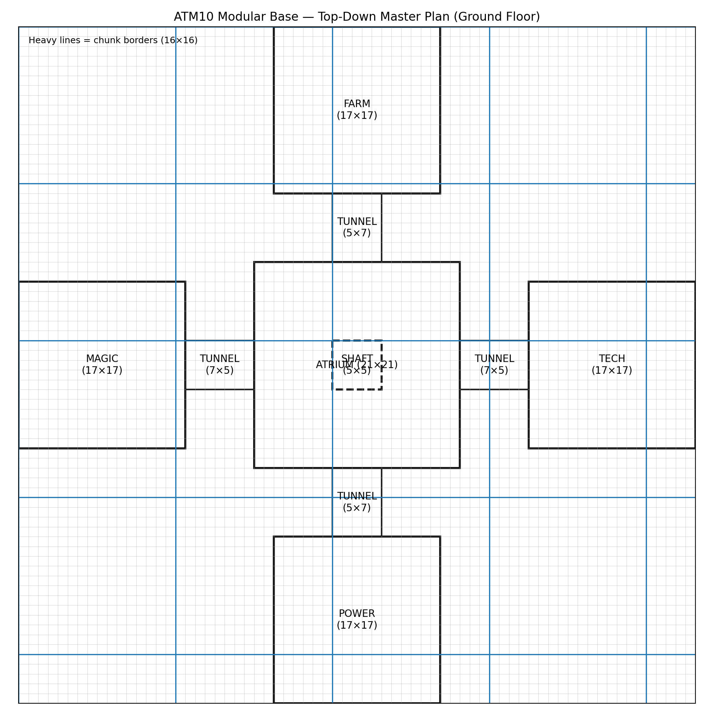

# Central Atrium

## Purpose
- Visual anchor
- Vertical routing spine
- Navigation hub

## Dimensions
- Footprint: 21×21
- Shaft: 5×5 (open)

## Materials
- Floor: Polished Andesite
- Ring: Brass Casing
- Walls: Polished Tuff Bricks
- Pillars: Andesite Pillars
- Windows: Framed Glass

## ASCII Plan
```
#####=====#####
#####=====#####
==           ==
==   SHAFT   ==
==           ==
#####=====#####
#####=====#####
```


## Top-down master plan

<p align="center">
  
</p>
