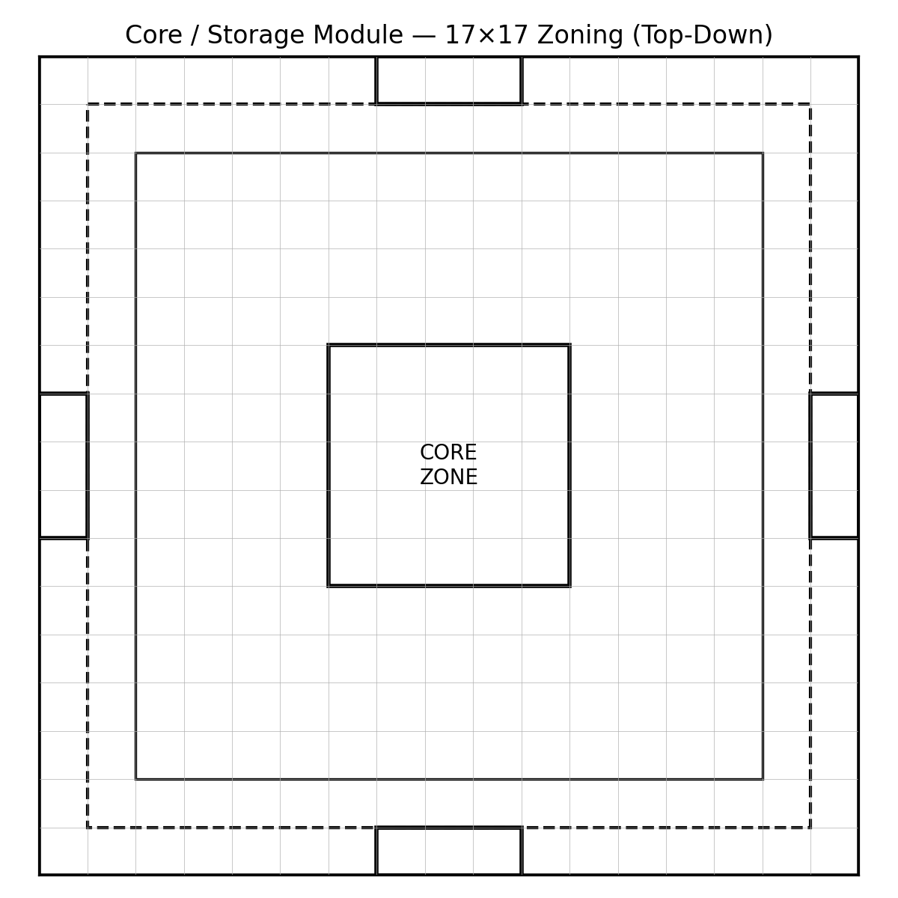
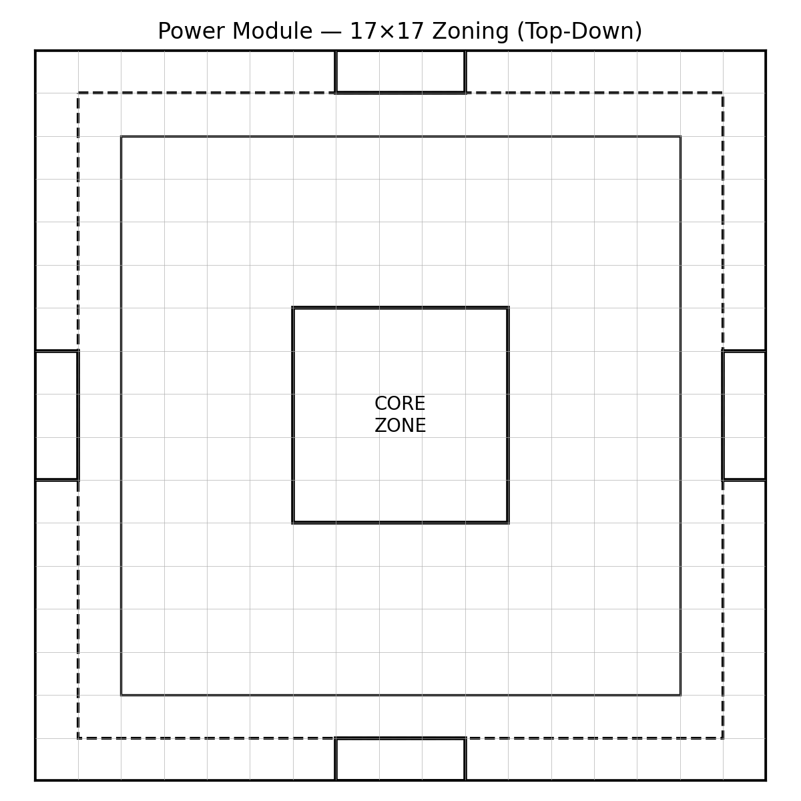
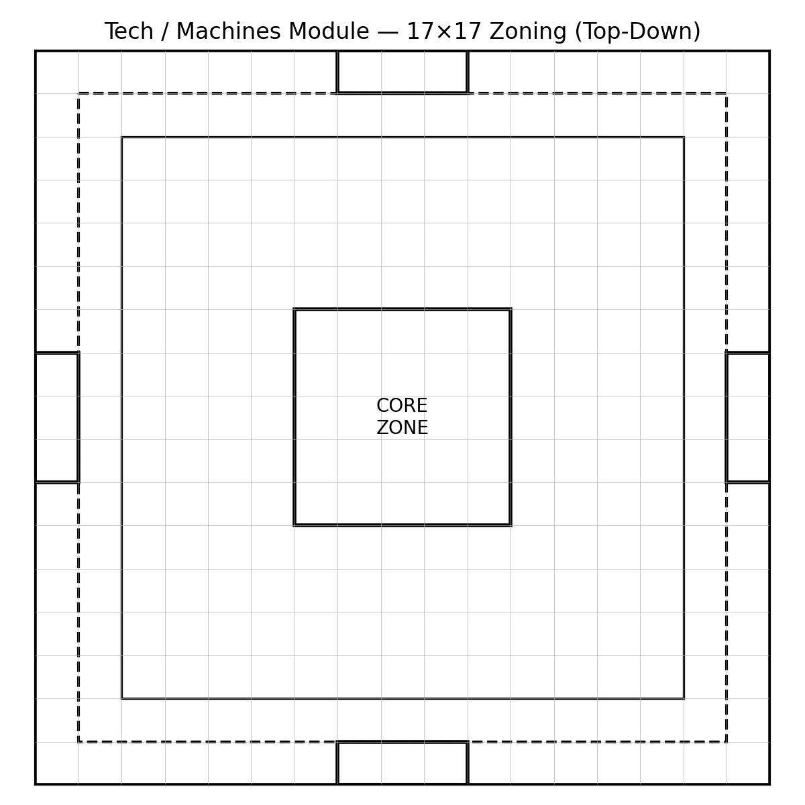
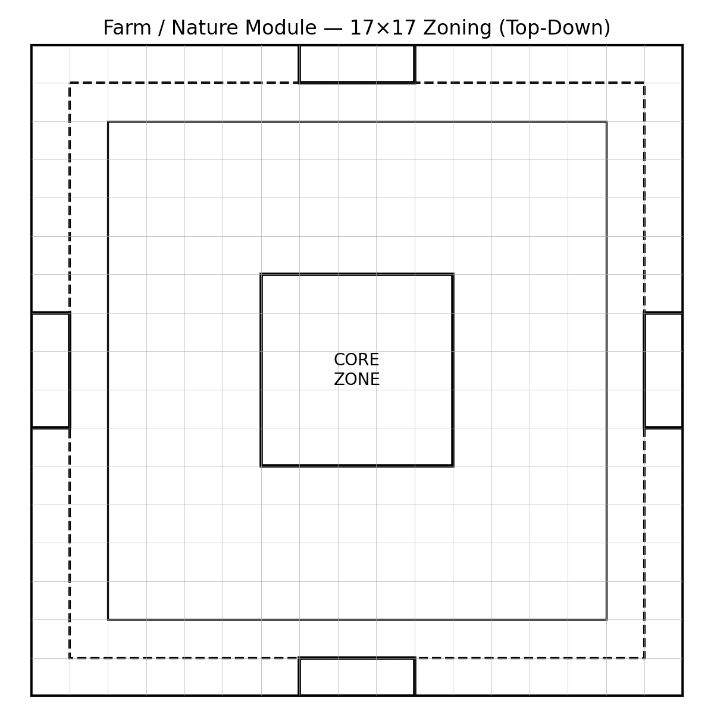
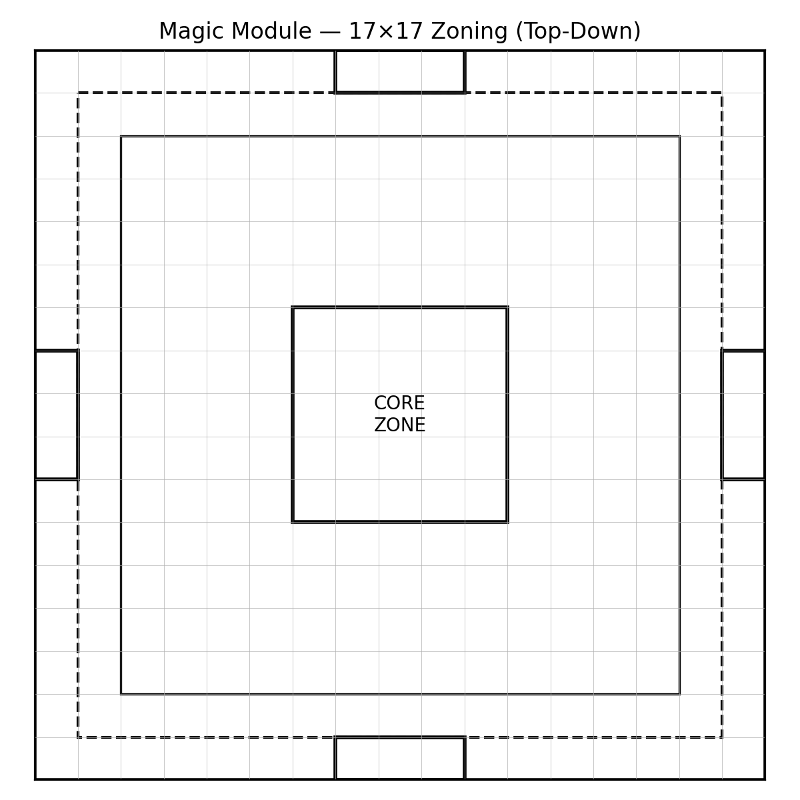

# Diagrams

All diagrams are top-down, block-scale planning visuals to pair with the written specs.

## Master Plan

  

## Module Zoning (17×17)

### Core / Storage

  

### Power

  

### Tech / Machines

  

### Farm / Nature

  

### Magic

  

## Files

SVG versions are also included in `assets/diagrams/` for crisp zooming on GitHub.
